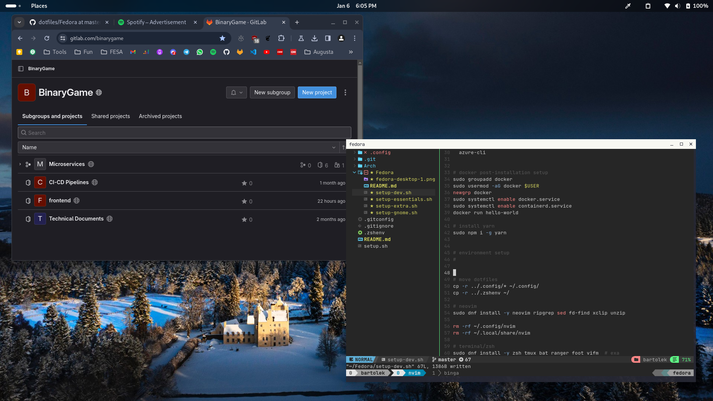
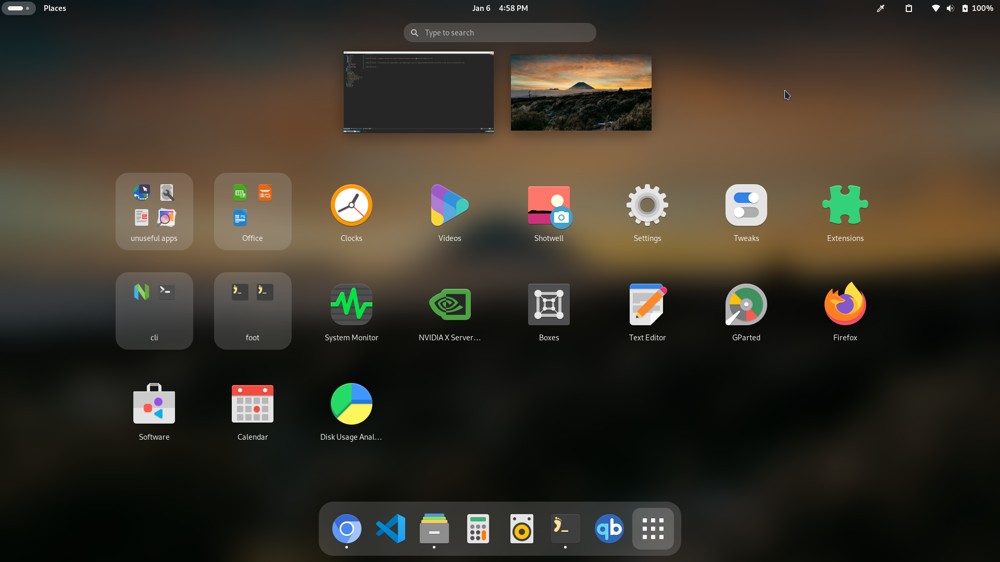

# DNF Commands

## Installation

- `dnf install` (any single package + dependencies)
- `dnf localinstall` (use .RPM downloaded file)
- `dnf groupinstall` (pre-defined group of packages)

## Uninstalling

- `dnf remove`

## Updating

- `dnf check-update [kernel]`
- `dnf update` (alias to dnf upgrade)
- `dnf upgrade`

## Others

- `dnf history`
- `dnf list all|<package_name>`
- `dnf search <package-name>`
- `dnf repolist all`

---

