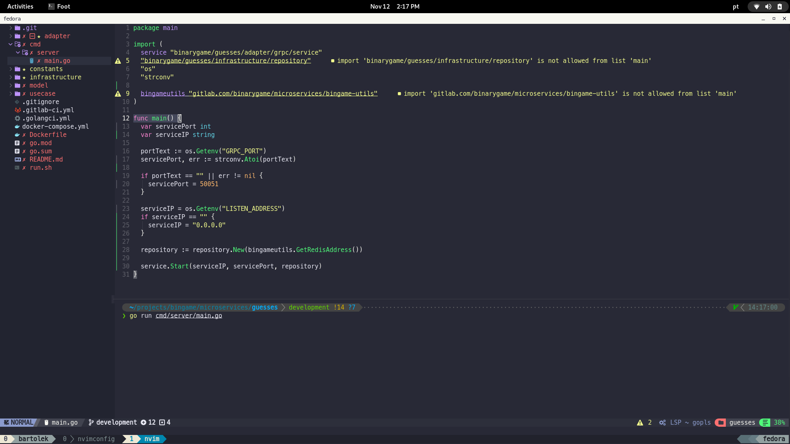

# Importing Dotfiles

List of softwares:
  * Tmux
  * Neovim
  * Zsh
  * Cava
  * Musikcube

```bash
git clone https://github.com/bartolek153/dotfiles
cd dotfiles
mv .config/* $HOME/.config/
mv .zshenv $HOME

# set ZSH as default shell (log out needed)
chsh -s $(which zsh)


# Neovim
#
# Check, before downloading plugins, if: 
# - Plugins call is enabled and 
# - Colorscheme call is disabled
nano $HOME/.config/nvim/init.lua

nvim # :checkhealth
```


